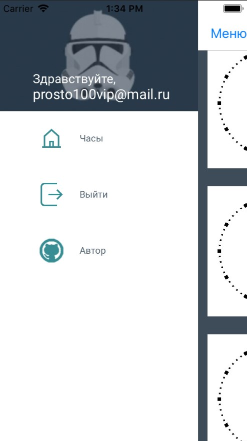
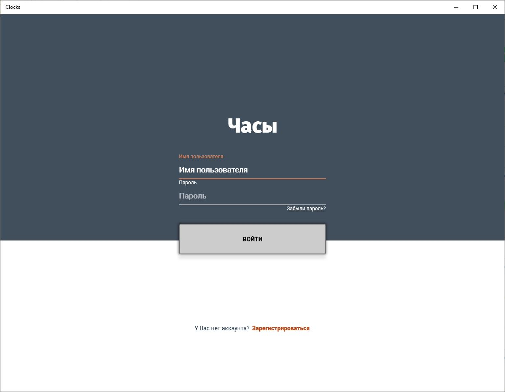

[license-image]: https://img.shields.io/npm/l/normalize.css.svg?style=flat
[license-url]: LICENSE
# Clocks.Clients [![license][license-image]][license-url]
Typical CRUD task with extended functionality. For Android, iOS and UWP. Login view with validations, popup views, bindings and custom controls.

## Install
- **[Install for Android](https://install.appcenter.ms/users/alexeyburyanov/apps/clocks.clients.android/distribution_groups/public)**
- **[Install for UWP](https://install.appcenter.ms/users/alexeyburyanov/apps/clocks.clients.uwp/distribution_groups/public)**

## Screenshots
    

   

  
  
 